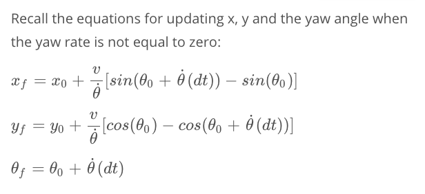
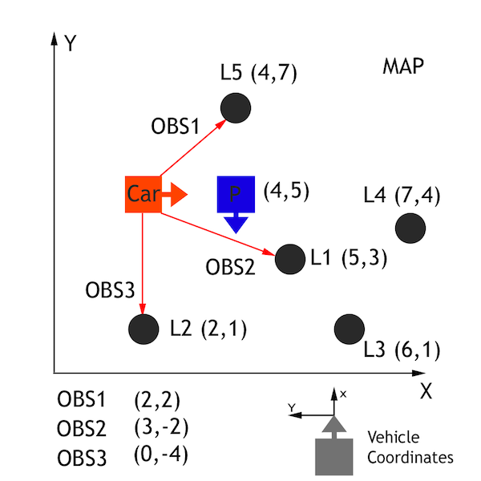
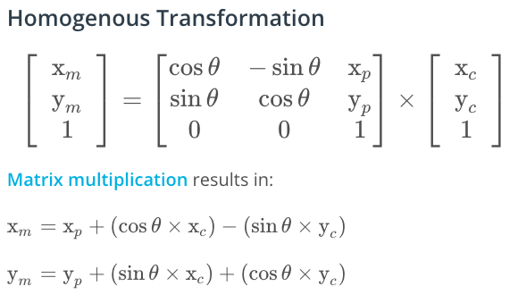
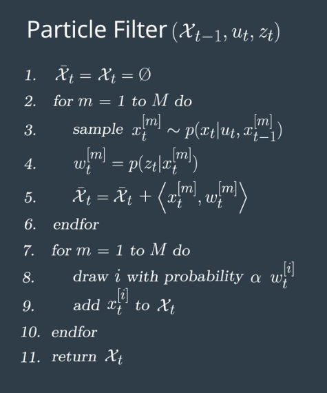
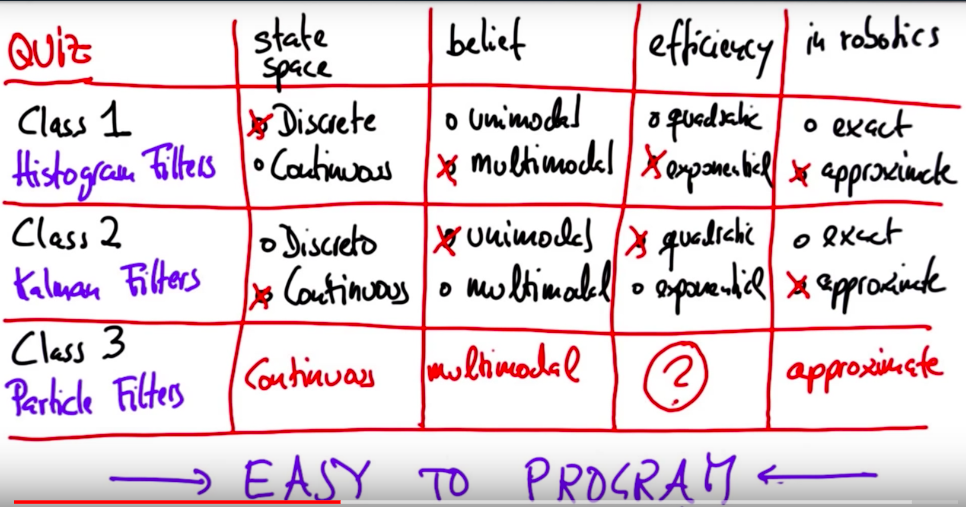

# Particle Filter Overview

### Steps:

1. **Initialization:** we can initialize the estimate location of the object using GPS data, randomly initialize the location of particles and their direction. 

    * a particle contains the following information:

      1. x and y position
      2. orientation (motion direction)

2. **Prediction:** use the motion model and the time of time (∆t) to predict the next location of every particle, and use the observation of each landmark to update the position of the landmarks in the internal map of each particle (particle observation).

    

3. **Update:** Calculate the weight of each particle through comparing the particle's landmark observations and with the landmark's true position. There are a few mini-steps:

    

    1. Transform landmark observations from vehicle's coordinate to map coordinate

        We can use the equation below to do such transformation, usually the rotation angle -90 degrees.

        

    2. Associate each observation with the closest landmark (ground truth)

    3. Update the weight (probability store) of each particle with multivariate Gaussian distribution:

       
    
        * **µx:** landmark's true x-position
        * **µy:** landmark's true y-position
        * **x:** particle's belief of the landmark's x-position (particle's x-position + landmark's observation)
        * **y:** particle's belief of the landmark's y-position (particle's y-position + landmark's observation)

4. **Resample:** We can pick next generations of particles with a probability distribution according to their weight. We can use resampling wheel to do so. (In implementation we can use `std::discrete_distribution` to avoid re-inventing the wheel).

## Pseudo-math/code

## Pros and Cons

