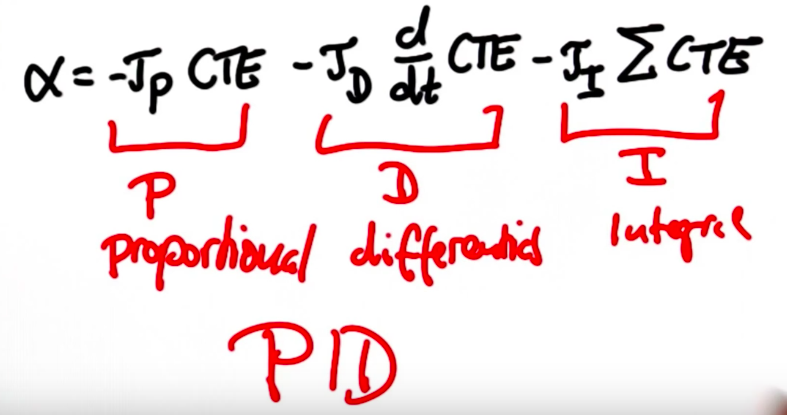

# Proportional Integral Derivative (PID) Controller

## Overview

* **prorportional:** gets a closer steering to the target direction proportional to the cross track error
* **Integral:** address the systematic bias of the model
* **Derivative:** prevents steering from overshooting

## Parameter Optimization

We need to optimize the control gains for each of the PID section (the different taus), and we can use the twiddle (or coordinate ascent) method as follow:

In short, the algorithm tries the three following ways:

1. Increase one of the parameter and see if error goes down
    * If error increase that parameter further and repeat
    * Else, decrease the parameter and repeat
2. If neither of decreases the error, decrease the change of the parameter (delta parameter) by multiple by 0.9
    
    def twiddle(tol=0.2): 
        p = [0, 0, 0]
        dp = [1, 1, 1]
        robot = make_robot()
        x_trajectory, y_trajectory, best_err = run(robot, p)

        it = 0
        while sum(dp) > tol:
            print("Iteration {}, best error = {}".format(it, best_err))
            for i in range(len(p)):
                p[i] += dp[i]
                robot = make_robot()
                x_trajectory, y_trajectory, err = run(robot, p)

                if err < best_err:
                    best_err = err
                    dp[i] *= 1.1
                else:
                    p[i] -= 2 * dp[i]
                    robot = make_robot()
                    x_trajectory, y_trajectory, err = run(robot, p)

                    if err < best_err:
                        best_err = err
                        dp[i] *= 1.1
                    else:
                        p[i] += dp[i]
                        dp[i] *= 0.9
            it += 1
        return p
